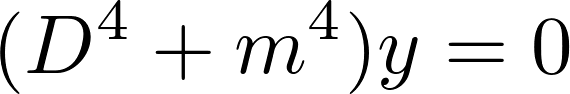

## MATHEMATICS-I
### B.C.A. Ist Year (First Semester) Examination, 2018
#### Paper No. BCA-104-N
Time : 3 Hours ; Maximum Marks : 70

***

Note :- Attempt any _five_ questions. All questions carry equal marks. Symbols have their usual meanings.

***

1. (a) Determmine the values of  for which the function :

&emsp; is continuous at .

&emsp; &ensp; (b) Examine the function defined below for continuity at  :

***

2. (a) If :

&emsp; prove that &nbsp; 

&emsp; &ensp; (b) If &nbsp; &nbsp;, show that :

***

3. (a) If &nbsp; 

&emsp; show that: 

&emsp; &ensp; (b) If &nbsp;  ,

&emsp; find the value of &nbsp; .

***

4. (a) If : 

&emsp; show that &nbsp; 

&emsp; &ensp; (b) Evaluate :

***

5. (a) Obtain the reduction formula for : 

&emsp; &ensp; (b) Find the area bounded by the parabola  and its latus rectum.

***

6. (a) Find the length of the astroid :

&emsp; &ensp; (b) Show that the volume of the sphere of radius  is 

.

***

7. (a) Evaluate .

&emsp; &ensp; (b) If &nbsp;, find :

***

8. (a) Solve the differential equation :

&emsp; &ensp; (b) Solve :

***

9. (a) Find the equation of the hyperbola whose focus is  , directrix  and eccentricity is 

&emsp; &ensp; (b) Find the vertex, focus and directrix of the parabola : 

