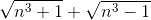

## MATHEMATICS-II
### B.C.A. Ist Year (Second Semester) Examination, 2019
#### Paper No. BCA-203-N
Time : 3 Hours ; Maximum Marks : 70

***

Note :- Attempt any _five_ questions. All questions carry equal marks. Symbols are used as usual.

***

1. (a) Prove that a bounded set has greatest and least limit points. 
(b) Prove that the derived set of every set is a closed set.

***

2. (a) If : 

&emsp;&emsp;&emsp;&ensp;find  and  if they exist.  
&emsp;&emsp;&emsp;(b) Evaluate : 

***

3. (a) Check the continuity for  of  defined by : 

&emsp;&emsp;&emsp;&ensp;when  and .  
&emsp;&emsp;&emsp;(b) show that the sum, difference and product of two functions continuous at a point  are continuous at this point.

***

4. (a) Test for convergence the series whose  term is : 

&emsp;&emsp;&emsp;(b) Test for convergence and divergence of the series : 

***

5. (a) State and prove p-series test.

***

6. (a) Expand sin _x_ by Maclaurin's theorem. 
(b) If the mean value theorem is : 

&emsp;&emsp;&emsp;find  when 

***

7. (a) Find the maximum and minimum value of  
(b) Show that the right circular cylinder of given surface (including the ends) and maximum volume is such that its height is equal to the diameter of the base.

***

8. (a) Show that if sequence converges, its limit is unique. 
(b) Check the roundedness and convergence of the sequence  if 